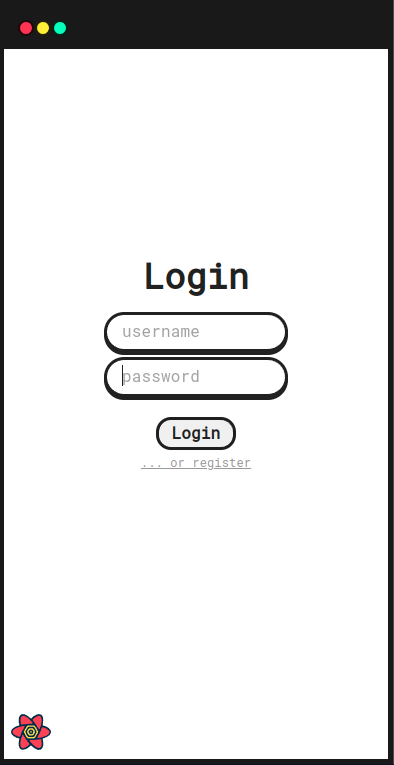
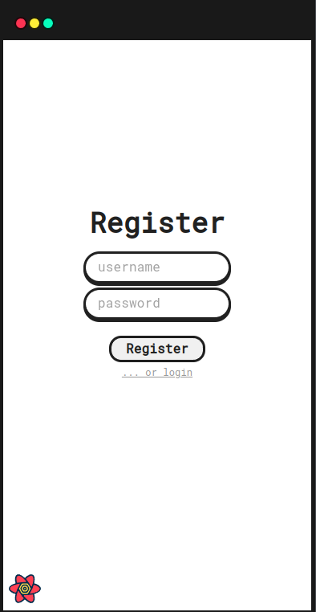
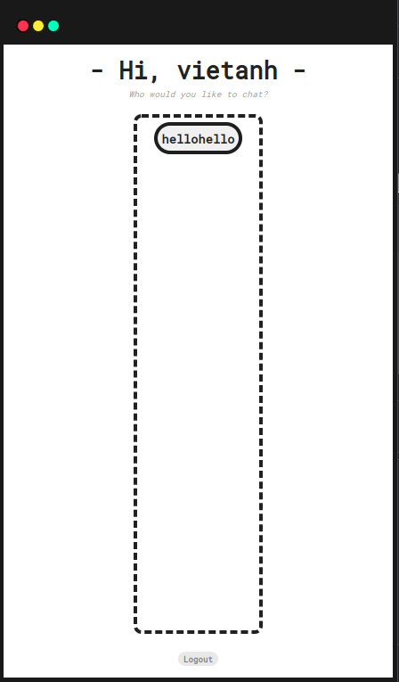
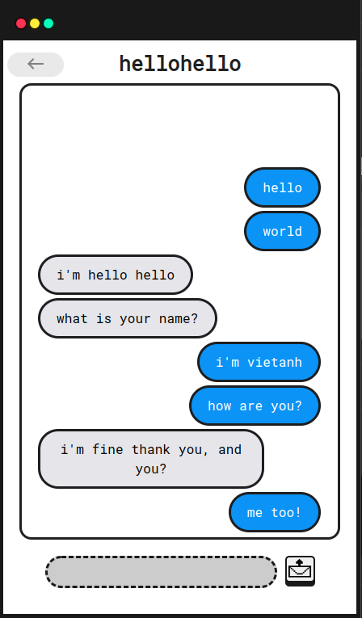

# signalchat

A project made for the submission of my undergraduate thesis, aiming to create a chat interface that applies my homemade library implementing the Signal Protocol (link: https://github.com/Mistsuu/native-rachet). This work is the result of following the documents of Moxie Marlinspike and Trevor Perrin *(link: https://signal.org/docs/)*. 

However, since the resulting application does not support **per-user identity key mode** to provide an in-person authentication method, it is still susceptible to the man-in-the-middle attack performed by the server.

This project is made for educational uses only.

## Requirements

This application has only been verified to be used in the environment of **Ubuntu 22.04** and **Ubuntu 20.04** only. It uses **NodeJS** as the backbone for the back-end and **Electron** with **ReactJS** as the backbone for the front-end.

- Packages: `libgmp3-dev`
- Node version: `16.14.0`

## How to run

1. First, you need to clone the repository and install Node packages:

   ```bash
   git clone https://github.com/Mistsuu/signalchat
   cd signalchat
   yarn install
   ```

2. Start the application:

   ```bash
   yarn dev
   ```

## Note

In order to connect to the server, please set the variable `BASE_URL` manually at `public/const/api.const.js` , as I have not provided a way to do choose it in the client interface :<

## Screenshots

- Login page

  

- Register page

  

- Home page

  

- Chat page

  
